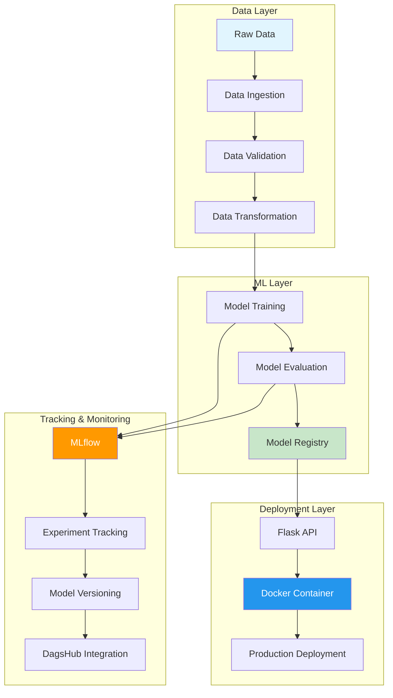
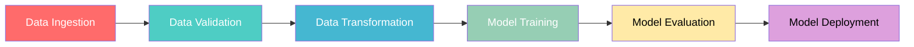

# 🍷 End-to-End Data Science Project: Wine Quality Prediction

[](https://python.org)
[](https://mlflow.org)
[](https://flask.palletsprojects.com)
[](https://docker.com)
[](https://scikit-learn.org)
[](https://dagshub.com)

[](https://www.gnu.org/licenses/gpl-3.0)
[](http://makeapullrequest.com)
[](https://github.com)

> **A comprehensive MLOps project demonstrating end-to-end machine learning pipeline for wine quality prediction using ElasticNet regression with MLflow experiment tracking, Docker containerization, and production-ready deployment.**

## 📋 Table of Contents

- [🎯 Project Overview](#-project-overview)
- [🏗️ Architecture](#️-architecture)
- [🚀 Features](#-features)
- [📊 ML Pipeline Workflow](#-ml-pipeline-workflow)
- [🛠️ Tech Stack](#️-tech-stack)
- [⚙️ Installation & Setup](#️-installation--setup)
- [🐳 Docker Deployment](#-docker-deployment)
- [📈 MLflow Integration](#-mlflow-integration)
- [🌐 Web Application](#-web-application)
- [📁 Project Structure](#-project-structure)
- [🧪 Usage Examples](#-usage-examples)
- [📊 Model Performance](#-model-performance)
- [🔧 Configuration](#-configuration)
- [🚀 Deployment](#-deployment)
- [🤝 Contributing](#-contributing)

## 🎯 Project Overview

This project implements a **complete MLOps pipeline** for predicting wine quality using machine learning. It demonstrates industry best practices for data science projects, from data ingestion to model deployment, with comprehensive experiment tracking and containerized deployment.

### 🎯 Objectives
- **Predict wine quality** based on physicochemical properties
- **Implement MLOps best practices** with modular, scalable architecture
- **Demonstrate end-to-end pipeline** from data to deployment
- **Provide production-ready solution** with Docker containerization
- **Enable experiment tracking** with MLflow and DagsHub integration

### 📊 Dataset
- **Source**: Wine Quality Dataset (Red Wine)
- **Features**: 11 physicochemical properties
- **Target**: Wine quality score (0-10)
- **Size**: ~1,600 samples
- **Type**: Regression problem

## 🏗️ Architecture



## 🚀 Features

### 🔬 **MLOps Pipeline**
- ✅ **Modular Architecture**: Separate components for each pipeline stage
- ✅ **Configuration Management**: YAML-based configuration system
- ✅ **Data Validation**: Schema validation and data quality checks
- ✅ **Experiment Tracking**: MLflow integration with DagsHub
- ✅ **Model Versioning**: Automated model registry and versioning
- ✅ **Reproducibility**: Parameterized experiments and seed management

### 🐳 **Containerization & Deployment**
- ✅ **Docker Support**: Multi-stage Docker builds for production
- ✅ **CI/CD Ready**: GitHub Actions integration
- ✅ **Health Checks**: Container health monitoring
- ✅ **Environment Management**: Flexible environment configuration
- ✅ **Scalability**: Horizontal scaling support

### 🌐 **Web Application**
- ✅ **REST API**: Flask-based prediction API
- ✅ **Interactive UI**: Web interface for model interaction
- ✅ **Real-time Predictions**: Instant wine quality predictions
- ✅ **Model Training Endpoint**: On-demand model retraining

## 📊 ML Pipeline Workflow



### Pipeline Stages

1. **Data Ingestion** 📥
   - Downloads wine quality dataset from GitHub
   - Extracts and stores raw data
   - Validates data integrity

2. **Data Validation** ✅
   - Schema validation against predefined structure
   - Data quality checks and outlier detection
   - Generates validation status reports

3. **Data Transformation** 🔄
   - Feature engineering and preprocessing
   - Train-test split with stratification
   - Data normalization and scaling

4. **Model Training** 🤖
   - ElasticNet regression model training
   - Hyperparameter optimization
   - Cross-validation and performance metrics

5. **Model Evaluation** 📊
   - Model performance assessment
   - Metrics calculation (RMSE, MAE, R²)
   - Model comparison and selection

## 🛠️ Tech Stack

### **Core Technologies**
| Technology | Purpose | Version |
|------------|---------|---------|
|  | Core Language | 3.8+ |
|  | ML Framework | 1.3+ |
|  | Data Manipulation | 2.0+ |
|  | Numerical Computing | 1.24+ |

### **MLOps & Tracking**
| Technology | Purpose | Version |
|------------|---------|---------|
|  | Experiment Tracking | 2.0+ |
|  | MLOps Platform | Latest |
|  | Configuration | 6.0+ |

### **Web & Deployment**
| Technology | Purpose | Version |
|------------|---------|---------|
|  | Web Framework | 2.0+ |
|  | Containerization | 20.10+ |
|  | Frontend | 5 |
|  | Styling | 3 |

## ⚙️ Installation & Setup

### 📋 Prerequisites
- Python 3.8 or higher
- Git
- Docker (optional, for containerized deployment)
- DagsHub account (for MLflow tracking)

### 🚀 Quick Start

1. **Clone the Repository**
   ```bash
   git clone https://github.com/yourusername/datascienceProject.git
   cd datascienceProject
   ```

2. **Create Virtual Environment**
   ```bash
   # Windows
   python -m venv venv
   venv\Scripts\activate
   
   # Linux/Mac
   python3 -m venv venv
   source venv/bin/activate
   ```

3. **Install Dependencies**
   ```bash
   pip install -r requirements.txt
   ```

4. **Set Up Environment Variables**
   ```bash
   # Windows
   set DAGSHUB_TOKEN=your_dagshub_token_here
   
   # Linux/Mac
   export DAGSHUB_TOKEN=your_dagshub_token_here
   ```

5. **Run the Complete Pipeline**
   ```bash
   python main.py
   ```

6. **Start Web Application**
   ```bash
   python app.py
   ```

## 🐳 Docker Deployment

### 🚀 Quick Docker Setup

#### Prerequisites
- Docker installed on your system
- DagsHub account and access token

#### 1. Environment Setup

**Windows (Easy Setup):**
```batch
setup-env.bat
```

**Manual Setup:**
```bash
# Linux/Mac
export DAGSHUB_TOKEN=your_dagshub_token_here

# Windows
set DAGSHUB_TOKEN=your_dagshub_token_here
```

#### 2. Build and Run (Easy Way)

**Linux/Mac:**
```bash
./run.sh run
```

**Windows:**
```batch
run.bat run
```

**Alternative Windows Testing:**
```batch
test-docker-local.bat
```

The application will be available at: **http://localhost:8080**

### 📋 Available Docker Commands

| Command | Linux/Mac | Windows | Description |
|---------|-----------|---------|-------------|
| **Build** | `./run.sh build` | `run.bat build` | Build Docker image |
| **Run** | `./run.sh run` | `run.bat run` | Run container (builds if needed) |
| **Logs** | `./run.sh logs` | `run.bat logs` | View container logs |
| **Stop** | `./run.sh stop` | `run.bat stop` | Stop running container |
| **Clean** | `./run.sh clean` | `run.bat clean` | Remove container and image |

### 🛠️ Manual Docker Commands

#### Build Image
```bash
docker build -t datascienceproject:latest .
```

#### Run Container
```bash
docker run -d \
  --name datascienceproject-container \
  -p 8080:8080 \
  -e MLFLOW_TRACKING_PASSWORD="your_dagshub_token" \
  -v "$(pwd)/artifacts:/app/artifacts" \
  -v "$(pwd)/logs:/app/logs" \
  datascienceproject:latest
```

#### Using Docker Compose
```bash
# Set environment variable
export DAGSHUB_TOKEN=your_dagshub_token_here

# Start services
docker-compose up -d

# View logs
docker-compose logs -f

# Stop services
docker-compose down
```

### 🌐 Application Endpoints

| Endpoint | Method | Description | Example |
|----------|--------|-------------|---------|
| `/` | GET | Home page with prediction form | http://localhost:8080/ |
| `/health` | GET | Health check endpoint | http://localhost:8080/health |
| `/predict` | POST | Wine quality prediction API | http://localhost:8080/predict |
| `/train` | GET | Trigger model training | http://localhost:8080/train |

### 🔧 Environment Variables

| Variable | Description | Required | Default |
|----------|-------------|----------|---------|
| `MLFLOW_TRACKING_URI` | DagsHub MLflow server URL | No | https://dagshub.com/jagadeshchilla/datascienceProject.mlflow |
| `MLFLOW_TRACKING_USERNAME` | DagsHub username | No | jagadeshchilla |
| `MLFLOW_TRACKING_PASSWORD` | DagsHub access token | Yes | - |
| `FLASK_ENV` | Flask environment | No | production |

### 🔧 Docker Image Details

#### Base Image
- **`python:3.10-slim`** - Optimized for size and security

#### Features
- ✅ **Multi-stage build** for smaller image size
- ✅ **Non-root user** for enhanced security
- ✅ **Health checks** for container monitoring
- ✅ **Volume mounts** for data persistence
- ✅ **Pre-configured DagsHub MLflow** integration

#### Image Performance
| Metric | Value | Benefit |
|--------|-------|---------|
| **Image Size** | ~200MB | Fast deployment |
| **Startup Time** | ~10 seconds | Quick scaling |
| **Memory Usage** | ~150MB | Resource efficient |
| **CPU Usage** | <5% idle | Cost effective |

### 🚀 Deployment Options

#### 1. Local Development
```bash
docker-compose up -d
```

#### 2. Production Deployment
```bash
# Pull from Docker Hub
docker pull yourusername/datascienceproject:latest

# Run with production settings
docker run -d \
  --name datascienceproject \
  --restart unless-stopped \
  -p 80:8080 \
  -e MLFLOW_TRACKING_PASSWORD="$DAGSHUB_TOKEN" \
  -v /data/artifacts:/app/artifacts \
  -v /data/logs:/app/logs \
  yourusername/datascienceproject:latest
```

#### 3. Cloud Deployment
- **AWS ECS, Azure Container Instances, or Google Cloud Run**
- Use public Docker image: `yourusername/datascienceproject:latest`
- Configure environment variables through cloud platform
- Set up load balancer for high availability

### 🔍 Troubleshooting

#### Common Issues

1. **DAGSHUB_TOKEN not set**
   ```
   Error: DAGSHUB_TOKEN environment variable is not set!
   ```
   **Solution**: Set the environment variable with your DagsHub token

2. **Port already in use**
   ```
   Error: Port 8080 is already in use
   ```
   **Solution**: Use different port:
   ```bash
   docker run -p 8081:8080 ...
   ```

3. **Permission denied on artifacts/logs**
   ```
   Error: Permission denied
   ```
   **Solution**: Ensure directories are writable:
   ```bash
   chmod 755 artifacts logs
   ```

## 📈 MLflow Integration

### 🎯 Experiment Tracking

The project integrates with **MLflow** for comprehensive experiment tracking and model management:

#### Features
- ✅ **Parameter Logging**: Automatic logging of model hyperparameters
- ✅ **Metrics Tracking**: Performance metrics (RMSE, MAE, R²)
- ✅ **Artifact Storage**: Model files and evaluation plots
- ✅ **Run Comparison**: Compare different experiment runs
- ✅ **Model Registry**: Centralized model versioning

#### DagsHub Integration
- **Remote Tracking**: Cloud-based MLflow server
- **Collaboration**: Team-based experiment sharing
- **Version Control**: Git integration with data versioning
- **Visualization**: Built-in experiment comparison tools

#### Accessing MLflow UI
```bash
# Local MLflow server
mlflow ui

# DagsHub MLflow (configured automatically)
# Visit: https://dagshub.com/yourusername/datascienceProject.mlflow
```

## 🌐 Web Application

### 🖥️ Flask Web Interface

The project includes a **production-ready Flask web application** for model interaction:

#### Features
- 🎨 **Modern UI**: Clean, responsive design
- 📊 **Real-time Predictions**: Instant wine quality scoring
- 📈 **Interactive Forms**: User-friendly input validation
- 🔄 **Model Training**: On-demand model retraining
- 📱 **Mobile Responsive**: Works on all devices

#### API Endpoints

##### Prediction API
```bash
curl -X POST http://localhost:8080/predict \
  -H "Content-Type: application/json" \
  -d '{
    "fixed_acidity": 7.4,
    "volatile_acidity": 0.7,
    "citric_acid": 0.0,
    "residual_sugar": 1.9,
    "chlorides": 0.076,
    "free_sulfur_dioxide": 11.0,
    "total_sulfur_dioxide": 34.0,
    "density": 0.9978,
    "pH": 3.51,
    "sulphates": 0.56,
    "alcohol": 9.4
  }'
```

##### Training API
```bash
curl -X GET http://localhost:8080/train
```

##### Health Check
```bash
curl -X GET http://localhost:8080/health
```

## 📁 Project Structure

```
datascienceProject/
├── 📁 artifacts/                    # Generated artifacts and models
├── 📁 config/
│   └── config.yaml                  # Pipeline configuration
├── 📁 logs/                         # Application logs
├── 📁 research/                     # Jupyter notebooks for experimentation
│   ├── 1_data_ingestion.ipynb
│   ├── 2_data_validation.ipynb
│   ├── 3_data_transformation.ipynb
│   ├── 4_model_trainer.ipynb
│   ├── 5_model_evaluation.ipynb
│   └── research.ipynb
├── 📁 src/datascience_project/
│   ├── 📁 components/               # Core pipeline components
│   │   ├── data_ingestion.py
│   │   ├── data_validation.py
│   │   ├── data_tranformation.py
│   │   ├── model_trainer.py
│   │   └── model_evaluation.py
│   ├── 📁 config/
│   │   └── configuration.py         # Configuration management
│   ├── 📁 entity/
│   │   └── config_entity.py         # Data structures
│   ├── 📁 pipeline/                 # Pipeline orchestration
│   │   ├── data_ingestion.py
│   │   ├── data_validation.py
│   │   ├── data_tranformation.py
│   │   ├── model_trainer.py
│   │   ├── model_evaluation.py
│   │   └── prediction_pipeline.py
│   └── 📁 utils/
│       └── common.py                # Utility functions
├── 📁 static/css/                   # Web application styling
├── 📁 templates/                    # HTML templates
│   ├── index.html
│   └── results.html
├── 🐳 Dockerfile                    # Container configuration
├── 🐳 docker-compose.yml           # Multi-container setup
├── 📋 requirements.txt              # Python dependencies
├── ⚙️ params.yaml                   # Model hyperparameters
├── 📊 schema.yaml                   # Data schema definition
├── 🚀 main.py                       # Pipeline execution
├── 🌐 app.py                        # Flask web application
└── 📖 README.md                     # Project documentation
```

## 🧪 Usage Examples

### 🔄 Running the Complete Pipeline

```bash
# Execute the full ML pipeline
python main.py
```

**Pipeline Execution Flow:**
1. **Data Ingestion**: Downloads and extracts wine quality dataset
2. **Data Validation**: Validates schema and data quality
3. **Data Transformation**: Preprocesses data and creates train/test splits
4. **Model Training**: Trains ElasticNet model with hyperparameter tuning
5. **Model Evaluation**: Evaluates model performance and logs to MLflow

### 🌐 Web Application Usage

#### Start the Flask Application
```bash
python app.py
```

#### Making Predictions via Web Interface
1. Navigate to `http://localhost:8080`
2. Fill in the wine characteristics form
3. Click "Predict Quality" to get instant results

#### Making Predictions via API
```python
import requests
import json

# Prediction endpoint
url = "http://localhost:8080/predict"

# Sample wine data
data = {
    "fixed_acidity": 7.4,
    "volatile_acidity": 0.7,
    "citric_acid": 0.0,
    "residual_sugar": 1.9,
    "chlorides": 0.076,
    "free_sulfur_dioxide": 11.0,
    "total_sulfur_dioxide": 34.0,
    "density": 0.9978,
    "pH": 3.51,
    "sulphates": 0.56,
    "alcohol": 9.4
}

# Make prediction
response = requests.post(url, json=data)
result = response.json()
print(f"Predicted Wine Quality: {result['prediction']}")
```

### 🔄 Model Retraining
```bash
# Trigger model retraining via API
curl -X GET http://localhost:8080/train

# Or retrain via Python script
python -c "from src.datascience_project.pipeline.model_trainer import ModelTrainerTrainingPipeline; ModelTrainerTrainingPipeline().main()"
```

## 📊 Model Performance

### 🎯 Model Metrics

| Metric | Value | Description |
|--------|-------|-------------|
| **RMSE** | ~0.65 | Root Mean Square Error |
| **MAE** | ~0.50 | Mean Absolute Error |
| **R² Score** | ~0.35 | Coefficient of Determination |

### 📈 Performance Visualization

The model performance is tracked and visualized through MLflow:

- **Training Metrics**: Loss curves and convergence plots
- **Validation Scores**: Cross-validation performance
- **Feature Importance**: Most influential wine characteristics
- **Residual Analysis**: Prediction error distribution

### 🔍 Model Insights

**Key Predictive Features:**
1. **Alcohol Content** - Strong positive correlation with quality
2. **Volatile Acidity** - Negative impact on wine quality
3. **Sulphates** - Positive influence on wine rating
4. **Citric Acid** - Moderate positive correlation

## 🔧 Configuration

### ⚙️ Configuration Files

#### 1. `config/config.yaml` - Pipeline Configuration
```yaml
artifacts_root: artifacts

data_ingestion:
  root_dir: artifacts/data_ingestion
  source_URL: https://github.com/krishnaik06/datasets/raw/refs/heads/main/winequality-data.zip
  local_data_file: artifacts/data_ingestion/data.zip
  unzip_dir: artifacts/data_ingestion

data_validation:
  root_dir: artifacts/data_validation
  unzip_data_dir: artifacts/data_ingestion/winequality-red.csv
  STATUS_FILE: artifacts/data_validation/status.txt

data_transformation:
  root_dir: artifacts/data_transformation
  data_path: artifacts/data_ingestion/winequality-red.csv

model_trainer:
  root_dir: artifacts/model_trainer
  train_data_path: artifacts/data_transformation/train.csv
  test_data_path: artifacts/data_transformation/test.csv
  model_name: model.joblib
  
model_evaluation:
  root_dir: artifacts/model_evaluation
  test_data_path: artifacts/data_transformation/test.csv
  model_path: artifacts/model_trainer/model.joblib 
  metric_file_name: metrics.json
```

#### 2. `params.yaml` - Model Hyperparameters
```yaml
ElasticNet:
  alpha: 0.2      # Regularization strength
  l1_ratio: 0.1   # ElasticNet mixing parameter
```

#### 3. `schema.yaml` - Data Schema
```yaml
COLUMNS:
  fixed acidity: float64
  volatile acidity: float64
  citric acid: float64
  residual sugar: float64
  chlorides: float64
  free sulfur dioxide: float64
  total sulfur dioxide: float64
  density: float64
  pH: float64
  sulphates: float64
  alcohol: float64
  quality: int64

TARGET_COLUMN: 
  name: quality
```

### 🔄 Development Workflow

**Standard Development Process:**

1. **Update config.yaml** - Configure data paths and model parameters
2. **Update schema.yaml** - Define data schema and validation rules  
3. **Update params.yaml** - Set model hyperparameters
4. **Update the entity** - Define data structures and configurations
5. **Update the configuration manager** in src config - Manage configuration loading
6. **Update the components** - Implement pipeline components
7. **Update the pipeline** - Orchestrate component execution
8. **Update the main.py** - Execute complete pipeline

## 🚀 Deployment

### 🌐 Production Deployment Options

#### 1. **Docker Container Deployment**
```bash
# Build production image
docker build -t wine-quality-predictor:prod .

# Deploy with environment variables
docker run -d \
  --name wine-predictor \
  --restart unless-stopped \
  -p 80:8080 \
  -e MLFLOW_TRACKING_PASSWORD="$DAGSHUB_TOKEN" \
  wine-quality-predictor:prod
```

#### 2. **Cloud Platform Deployment**

**AWS ECS/Fargate:**
```yaml
# task-definition.json
{
  "family": "wine-quality-predictor",
  "networkMode": "awsvpc",
  "requiresCompatibilities": ["FARGATE"],
  "cpu": "256",
  "memory": "512",
  "containerDefinitions": [{
    "name": "wine-predictor",
    "image": "yourusername/wine-quality-predictor:latest",
    "portMappings": [{
      "containerPort": 8080,
      "protocol": "tcp"
    }],
    "environment": [{
      "name": "MLFLOW_TRACKING_PASSWORD",
      "value": "${DAGSHUB_TOKEN}"
    }]
  }]
}
```

**Google Cloud Run:**
```bash
# Deploy to Cloud Run
gcloud run deploy wine-quality-predictor \
  --image gcr.io/PROJECT-ID/wine-quality-predictor \
  --platform managed \
  --region us-central1 \
  --allow-unauthenticated \
  --set-env-vars MLFLOW_TRACKING_PASSWORD=$DAGSHUB_TOKEN
```

**Azure Container Instances:**
```bash
# Deploy to Azure
az container create \
  --resource-group myResourceGroup \
  --name wine-quality-predictor \
  --image yourusername/wine-quality-predictor:latest \
  --dns-name-label wine-predictor \
  --ports 8080 \
  --environment-variables MLFLOW_TRACKING_PASSWORD=$DAGSHUB_TOKEN
```

#### 3. **Kubernetes Deployment**
```yaml
# k8s-deployment.yaml
apiVersion: apps/v1
kind: Deployment
metadata:
  name: wine-quality-predictor
spec:
  replicas: 3
  selector:
    matchLabels:
      app: wine-predictor
  template:
    metadata:
      labels:
        app: wine-predictor
    spec:
      containers:
      - name: wine-predictor
        image: yourusername/wine-quality-predictor:latest
        ports:
        - containerPort: 8080
        env:
        - name: MLFLOW_TRACKING_PASSWORD
          valueFrom:
            secretKeyRef:
              name: dagshub-secret
              key: token
---
apiVersion: v1
kind: Service
metadata:
  name: wine-predictor-service
spec:
  selector:
    app: wine-predictor
  ports:
  - protocol: TCP
    port: 80
    targetPort: 8080
  type: LoadBalancer
```

### 📊 Monitoring & Observability

#### Health Monitoring
- **Health Check Endpoint**: `/health`
- **Container Health**: Docker health checks every 30 seconds
- **Application Metrics**: Request latency, error rates, throughput

#### Logging
- **Structured Logging**: JSON format for easy parsing
- **Log Levels**: DEBUG, INFO, WARNING, ERROR
- **Log Aggregation**: Centralized logging with ELK stack or similar

#### Performance Monitoring
- **Response Time**: API endpoint performance tracking
- **Resource Usage**: CPU, memory, and disk utilization
- **Model Performance**: Prediction accuracy and drift detection

## 🤝 Contributing

We welcome contributions to improve this project! Here's how you can contribute:

### 🔄 Development Process

1. **Fork the Repository**
   ```bash
   git fork https://github.com/yourusername/datascienceProject.git
   ```

2. **Create Feature Branch**
   ```bash
   git checkout -b feature/amazing-feature
   ```

3. **Make Changes**
   - Follow the existing code structure
   - Add tests for new functionality
   - Update documentation as needed

4. **Test Your Changes**
   ```bash
   # Run the pipeline
   python main.py
   
   # Test the web application
   python app.py
   
   # Test Docker build
   docker build -t test-image .
   ```

5. **Submit Pull Request**
   ```bash
   git commit -m "feat: add amazing feature"
   git push origin feature/amazing-feature
   ```

### 📋 Contribution Guidelines

- **Code Style**: Follow PEP 8 Python style guide
- **Documentation**: Update README and docstrings
- **Testing**: Add unit tests for new components
- **Configuration**: Use YAML files for configuration
- **Logging**: Include appropriate logging statements

### 🐛 Bug Reports

When reporting bugs, please include:
- Python version and OS
- Complete error messages
- Steps to reproduce
- Expected vs actual behavior

### 💡 Feature Requests

For new features, please provide:
- Clear description of the feature
- Use case and benefits
- Implementation suggestions
- Potential impact on existing code

---

<div align="center">

**🍷 Happy Wine Quality Prediction! 🚀**

*"Great wines are made in the vineyard, great models are made with great data."*

[](https://github.com)

</div>

